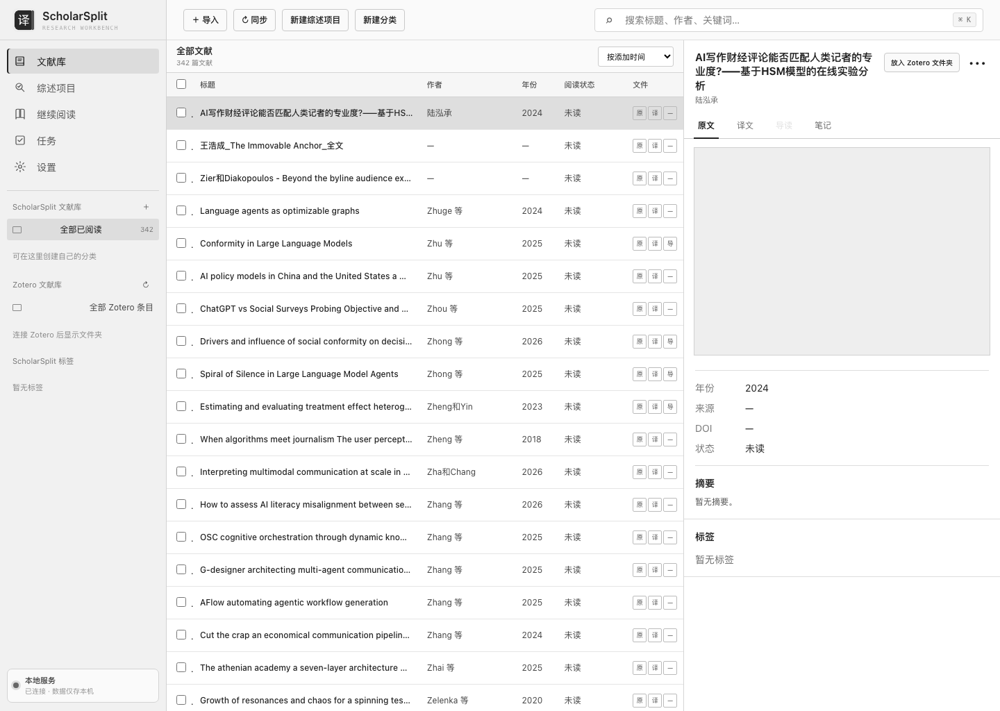

<p align="center">
  
</p>

<h1 align="center">ScholarSplit</h1>

<p align="center">本地优先的论文双读与个人文献研究工作台。</p>

ScholarSplit 把 Chrome 里的论文翻译、结构化导读和本机文献库放在同一条工作流里。打开 PDF 后可以生成译文与导读；进入 `http://127.0.0.1:8890/workspace`，则可以按 Zotero 式三栏界面管理原文、译文、导读、阅读状态、综述项目、证据、研究空白和继续阅读建议。



## v0.2.0 能做什么

- 在 Chrome 中处理在线或本地 PDF，并排查看译文与中文导读。
- 原位索引本机 PDF，不移动、不复制 Zotero 附件；以 SHA-256、DOI、arXiv ID 和标题年份去重。
- 使用 SQLite、WAL 和 FTS5 保存文献、集合、标签、笔记、阅读状态、项目、证据、综述、gap、推荐和任务。
- 在探索式或系统式综述项目中记录筛选理由，生成带页码来源的证据卡和主张导向证据矩阵。
- 将 gap 标记为“证据、推断、假设或未验证”，同时保留关联文献与语料边界。
- 先推荐本地遗漏文献，再查询开放元数据；每条建议说明推荐理由。
- 通过受控命令队列与 Zotero 同步集合、标签和子笔记；从不直接写 `zotero.sqlite`。
- 浏览器不读取模型 API Key；配对令牌仅保存在本机且文件权限为 `0600`。

## 复制给 Agent 一键安装

把下面这一整行复制给 Codex、Claude Code 或其他本地编程 Agent：

```text
请安装 ScholarSplit：https://github.com/haochengw372-hash/scholar-split；完整阅读 AGENT_INSTALL.md 后克隆仓库，运行 ./scripts/install.sh 和全部测试；若本机已有 127.0.0.1:8890 的兼容翻译服务，就安装 integrations/server 与 Zotero bridge 并验证 /workspace、/api/v1/summary、翻译和导读接口；不得读取、打印、上传或提交 API Key、论文和个人路径；Chrome 或 Zotero 需要我确认加载扩展时再提醒我。
```

只准备 Chrome 扩展也可以直接运行：

```bash
git clone https://github.com/haochengw372-hash/scholar-split.git && cd scholar-split && ./scripts/install.sh
```

Chrome 不允许普通脚本静默安装开发者扩展。脚本会将扩展复制到稳定目录，最后仍需在 `chrome://extensions` 中点击一次“加载已解压的扩展程序”。

## 使用

1. 确认本地服务：访问 `http://127.0.0.1:8890/health`。
2. 在 Chrome 加载脚本输出的 `extension` 目录。
3. 打开论文 PDF，点击工具栏里的“ScholarSplit 论文双读”。
4. 打开 `http://127.0.0.1:8890/workspace` 管理文献和综述项目。

本地 `file://` PDF 还需要在扩展详情中开启“允许访问文件网址”。出版社登录页、一次性链接或受限资源应先通过合法入口下载，再用“选择已下载的 PDF”；ScholarSplit 不绕过付费墙，也不保存出版社密码。

## 本地服务与 API

仓库根目录的 Chrome 扩展保持独立。`integrations/server/` 是可嵌入兼容 Flask 翻译服务的工作台模块，提供 `/workspace` 与 `/api/v1/*`；原有 `/translate`、`/guide`、`/api/tasks`、`/api/history` 和文件读取接口保持兼容。完整接口边界见 [本地服务协议](docs/LOCAL_SERVICE_PROTOCOL.md)。

Zotero 侧桥接代码位于 `integrations/zotero/`。它只调用 Zotero 公共 API 和 `Zotero.Notifier`，只接受集合成员、标签和新建子笔记三类写命令，并对版本冲突与重试保留审计记录。

## 开发与验证

项目的网页与扩展没有 npm 运行时依赖：

```bash
npm test
npm run check
./scripts/package.sh
```

Python 测试覆盖索引幂等、哈希去重、导读匹配、FTS5、API 回环限制、Zotero 命令契约、证据页码、gap 标签、推荐去重和获取确认门。

## 隐私、许可证与第三方代码

- 本地服务必须仅绑定回环地址；仓库不包含遥测。
- PDF、数据库、任务、导读、模型凭据和 Zotero 配对令牌都不得提交到 GitHub。
- Chrome 扩展、工作台前端和独立项目代码采用 [MIT License](LICENSE)。
- `integrations/server/` 在与受支持的 AGPL 后端组合分发时，以及 `integrations/zotero/` 中的桥接代码，采用 AGPL-3.0-or-later；详见目录许可证和[第三方声明](THIRD_PARTY_NOTICES.md)。

当前版本为 ScholarSplit `v0.2.0`。
