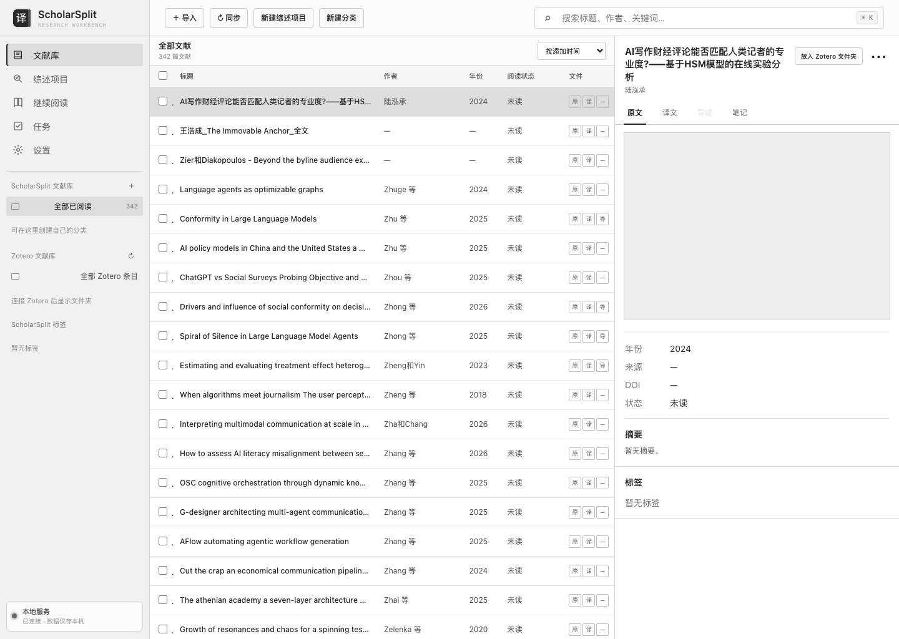

> 使用请引用：如果你在论文、研究报告或项目中使用 ScholarSplit，请引用 **Haocheng Wang (2026). ScholarSplit**，并注明项目地址和所用版本。引用信息见 [CITATION.cff](CITATION.cff)。这是学术引用请求，不是额外的许可证限制。

<p align="center">
  
</p>

<h1 align="center">ScholarSplit</h1>

<p align="center">本地优先的论文双读与个人文献研究工作台。</p>

ScholarSplit 把 Chrome 里的论文翻译、结构化导读和本机文献库放在同一条工作流里。打开 PDF 后可以生成译文与导读；进入 `http://127.0.0.1:8890/workspace`，则可以按 Zotero 式三栏界面管理原文、译文、导读、阅读状态、综述项目、证据、研究空白和继续阅读建议。



## v0.3.4 能做什么

- 在 Chrome 中处理在线或本地 PDF，并排查看译文与中文导读。
- 完整 Zotero 插件与本地翻译主机可从本仓库构建、安装；默认集成 PDF2zh-next 与 BabelDOC，另可安装旧版 PDF2zh。
- 原位索引本机 PDF，不移动、不复制 Zotero 附件；以 SHA-256、DOI、arXiv ID 和标题年份去重。
- 使用 SQLite、WAL 和 FTS5 保存文献、集合、标签、笔记、阅读状态、项目、证据、综述、gap、推荐和任务。
- 在探索式或系统式综述项目中记录筛选理由，生成带页码来源的证据卡和主张导向证据矩阵。
- 将 gap 标记为“证据、推断、假设或未验证”，同时保留关联文献与语料边界。
- 先推荐本地遗漏文献，再查询开放元数据；每条建议说明推荐理由。
- 通过受控命令队列与 Zotero 同步集合、标签和子笔记；从不直接写 `zotero.sqlite`。
- Zotero 可一键用 DeepSeek 审阅论文中的过度防御性措辞；可精确定位的句子以红色批注标记并附修改方向。
- Zotero 右侧新增“论文问答”：直接提问当前 PDF，显示当前 PDF 摘录与可跳转页码，按论文保存本地对话。
- 问答输入框在读取中和读取失败时仍显示；同一 PDF 的条目刷新不会清空聊天面板。
- Zotero 导读直接读取当前打开或选中的 PDF，支持原文、译文和双语件，不再要求找到配对附件；引用对应实际输入 PDF 页码。
- 浏览器不读取模型 API Key；配对令牌仅保存在本机且文件权限为 `0600`。

## 复制给 Agent 一键安装

把下面这一整行复制给 Codex、Claude Code 或其他本地编程 Agent：

```text
请安装 ScholarSplit：https://github.com/haochengw372-hash/scholar-split；先阅读 AGENT_INSTALL.md，下载最新 Release 完整包并校验 SHA256SUMS，运行 ./scripts/install.sh 安装 Chrome 扩展、完整本地服务与 PDF2zh-next，验证 /health、/workspace 和 /api/v1/summary；保留已有配置、数据库与服务，不读取或上传 API Key；引导我在本机无回显配置模型，再在 Chrome 加载 extension 并在 Zotero 从文件安装包内 XPI；不得上传论文或直接写 zotero.sqlite。
```

完整发行包见 [GitHub Releases](https://github.com/haochengw372-hash/scholar-split/releases/latest)。也可从源码安装（需要 uv、Python 3.12 和 Node.js 22+）：

```bash
git clone https://github.com/haochengw372-hash/scholar-split.git && cd scholar-split && (cd integrations/zotero/plugin && npm ci --ignore-scripts && npm test && npm run build) && ./scripts/install.sh
```

Chrome 不允许普通脚本静默安装开发者扩展。脚本会将扩展复制到稳定目录，最后仍需在 `chrome://extensions` 中点击一次“加载已解压的扩展程序”。

默认安装 PDF2zh-next 2.9.0 和 BabelDOC 0.6.2。需要旧版 PDF2zh 1.9.11 时运行 `./scripts/install.sh --legacy`；引擎使用独立环境，不能混装。字体与版面分析模型在首次使用时下载，不打包私人模型缓存。

安装目录默认位于 macOS 的 `~/Library/Application Support/ScholarSplit`。在该目录运行 `server/.venv/bin/python server/configure.py`，通过无回显输入保存 DeepSeek 密钥；浏览器不接触密钥。自定义安装位置用 `SCHOLAR_SPLIT_INSTALL_ROOT`。

## 使用

1. 确认本地服务：访问 `http://127.0.0.1:8890/health`。
2. 在 Chrome 加载脚本输出的 `extension` 目录。
3. 在 Zotero 的“工具 → 插件 → 从文件安装插件”选择发行包 XPI；或在 Chrome 打开 PDF 点击“ScholarSplit 论文双读”。
4. 打开 `http://127.0.0.1:8890/workspace` 管理文献和综述项目。

本地 `file://` PDF 还需要在扩展详情中开启“允许访问文件网址”。出版社登录页、一次性链接或受限资源应先通过合法入口下载，再用“选择已下载的 PDF”；ScholarSplit 不绕过付费墙，也不保存出版社密码。

Zotero 插件沿用旧 PDF2zh 插件 ID 以保留偏好设置，因此会更新/替换原 PDF2zh 导读版，不能同时安装两个相同 ID 的插件。新译文记录原文附件关联，重命名不再依赖标题猜测；旧译文可关联唯一原文，存在多个候选时需要选择。

## 本地服务与 API

仓库根目录的 Chrome 扩展保持独立。`integrations/server/host/` 是完整翻译主机，`integrations/server/*.py` 为工作台模块，安装后共同提供 `/workspace`、`/api/v1/*`、`/translate`、`/guide`、`/api/tasks`、`/api/history` 与文件接口。完整接口边界见 [本地服务协议](docs/LOCAL_SERVICE_PROTOCOL.md)。

完整 Zotero 源码位于 `integrations/zotero/plugin/`，桥接只调用 Zotero 公共 API 与 `Zotero.Notifier`，对集合、标签、子笔记及受控文献导入保留审计记录。

## 开发与验证

项目的网页与扩展没有 npm 运行时依赖：

```bash
python3 -m pip install -r integrations/server/host/requirements.txt pytest
npm --prefix integrations/zotero/plugin ci --ignore-scripts --no-audit --no-fund
npm test
npm run check
# Zotero：cd integrations/zotero/plugin && npm ci && npm test && npm run build
./scripts/package.sh --xpi "$(find integrations/zotero/plugin/build -name '*.xpi' -print -quit)"
```

Python 测试覆盖索引幂等、哈希去重、导读匹配、FTS5、API 回环限制、Zotero 命令契约、证据页码、gap 标签、推荐去重和获取确认门。

## 隐私、许可证与第三方代码

- 本地服务必须仅绑定回环地址；仓库不包含遥测。
- PDF、数据库、任务、导读、模型凭据和 Zotero 配对令牌都不得提交到 GitHub。
- Chrome 扩展、工作台前端和独立项目代码采用 [Apache License 2.0](LICENSE)，版权归 Haocheng Wang 及项目贡献者；署名信息见 [NOTICE](NOTICE)。
- 完整翻译主机、Zotero 插件和 `integrations/` 仍采用 AGPL-3.0-or-later；根目录的 Apache-2.0 不会覆盖第三方许可证。详见[第三方声明](THIRD_PARTY_NOTICES.md)与[上游修改记录](docs/UPSTREAM.md)。

当前版本为 ScholarSplit `v0.3.4`，Zotero 插件 `4.1.8-guide.17`。此前 MIT 发行版本保持原许可证。
